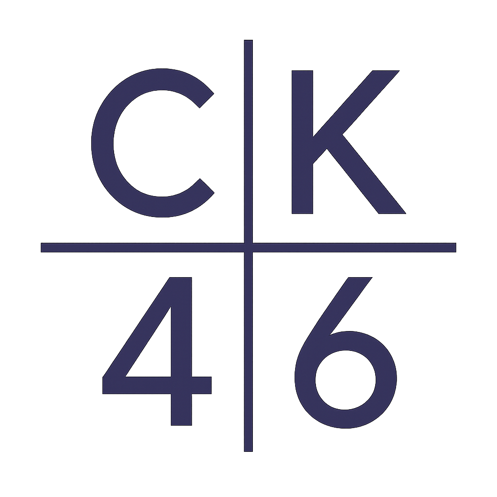

# CK46 — Personal Website

This is the personal website of Chansa Kabwe (ck46), built with React, Vite, and TailwindCSS. It showcases projects, research models, and contact information, and integrates with GitHub and Hugging Face Hub.



## Features
- **Highlighted Projects:** Fetches and displays top GitHub repositories for [ck46](https://github.com/ck46).
- **Research Models:** Lists public models from [Hugging Face Hub](https://huggingface.co/ck46).
- **Contact Section:** Quick links to GitHub, Hugging Face, and LinkedIn.
- **Modern UI:** Responsive, clean design using TailwindCSS with a custom primary color (`#342d3b`).
- **Analytics:** Integrated with Vercel Analytics.
- **Chat Widget:** Placeholder for future AI chat functionality.

## Getting Started

### Prerequisites
- [Node.js](https://nodejs.org/) (v18 or newer recommended)
- [npm](https://www.npmjs.com/) or [yarn](https://yarnpkg.com/)

### Installation
```bash
npm install
# or
yarn install
```

### Development
```bash
npm run dev
# or
yarn dev
```
Visit [http://localhost:5173](http://localhost:5173) in your browser.

### Build for Production
```bash
npm run build
# or
yarn build
```

### Preview Production Build
```bash
npm run preview
# or
yarn preview
```

## Project Structure
- `src/App.jsx` — Main app logic, data fetching, and UI components
- `src/index.css` — TailwindCSS and base styles
- `public/` — Static assets (logos, favicon)
- `tailwind.config.js` — Tailwind theme customization

## Customization
- **Primary Color:** Change in `tailwind.config.js` under `theme.extend.colors.primary`.
- **Profile Data:** Update GitHub and Hugging Face usernames in `src/App.jsx` if you fork this repo.

## Credits
- [React](https://react.dev/)
- [Vite](https://vitejs.dev/)
- [TailwindCSS](https://tailwindcss.com/)
- [GitHub API](https://docs.github.com/en/rest)
- [Hugging Face Hub API](https://huggingface.co/docs/hub/api)
- [Vercel Analytics](https://vercel.com/analytics)

## Licensing

This project operates under a split-license model:

-   **Code**: The source code (React components, utility logic, build scripts) is licensed under the **MIT License**. See [LICENSE](LICENSE).
-   **Content & Brand**: All website copy, images, "NjiraAI" product materials, and specific data files (e.g., `src/data/content.ts`) are **Copyright © 2026 CK. All Rights Reserved**. See [CONTENT_LICENSE](CONTENT_LICENSE.md).

If you fork this repo, please remove all proprietary content and branding. If you want to reuse any content, please contact me.

---

© 2026 Chansa Kabwe (ck46). All rights reserved.
