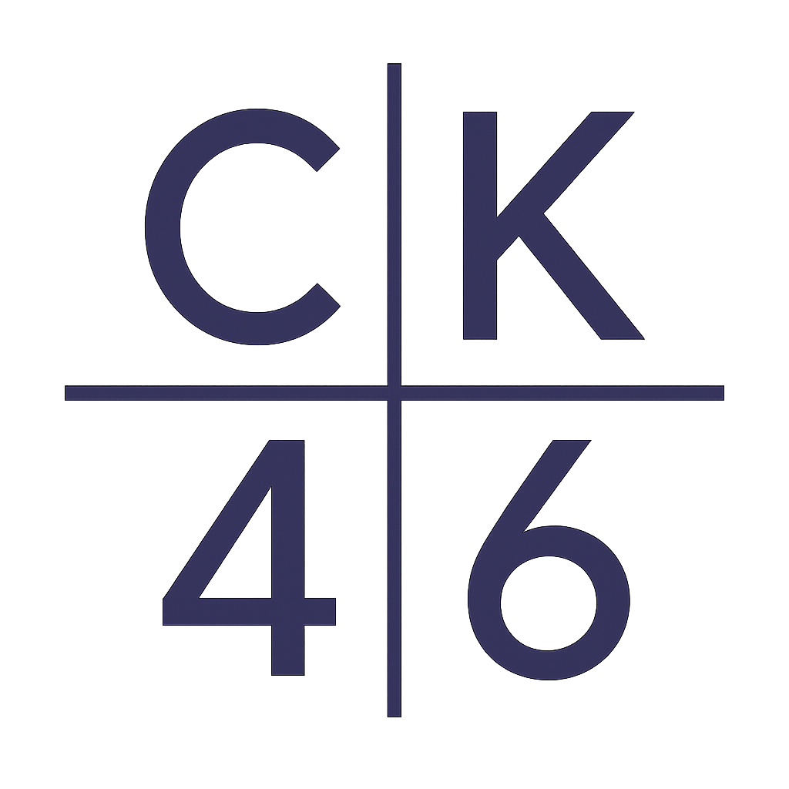

# CK46 — Personal Website

This is the personal website of Chansa Kabwe (ck46), built with Next.js and TailwindCSS. It presents public projects, selected research preprints, consulting work, and contact paths.



## Features
- **Public Projects:** Shows selected public projects and GitHub repositories.
- **Research:** Lists public preprints and conference work that are ready for external discussion.
- **Consulting:** Describes focused AI safety, reliability, and evaluation services.
- **Contact:** Provides a short intake path for advisory, investment, and research conversations.
- **Modern UI:** Responsive terminal-style interface using TailwindCSS.
- **Analytics:** Integrated with Vercel Analytics.

## Getting Started

### Prerequisites
- [Node.js](https://nodejs.org/) (v18 or newer recommended)
- [npm](https://www.npmjs.com/) or [yarn](https://yarnpkg.com/)

### Installation
```bash
npm install
# or
yarn install
```

### Development
```bash
npm run dev
```
Visit [http://localhost:3000](http://localhost:3000) in your browser.

### Build for Production
```bash
npm run build
```

### Start Production Build
```bash
npm run start
```

## Project Structure
- `src/app/` — Next.js app routes and page components
- `src/components/` — Shared UI components
- `src/data/` — Site, project, and content configuration
- `src/app/globals.css` — TailwindCSS and base styles
- `public/` — Static assets (logos, favicon)
- `tailwind.config.js` — Tailwind theme customization

## Customization
- **Primary Color:** Change in `tailwind.config.js` under `theme.extend.colors.primary`.
- **Site Copy:** Update public-facing content in `src/data/site.ts` and `src/data/projects.ts`.

## Credits
- [React](https://react.dev/)
- [Next.js](https://nextjs.org/)
- [TailwindCSS](https://tailwindcss.com/)
- [Vercel Analytics](https://vercel.com/analytics)

## Licensing

This project operates under a split-license model:

-   **Code**: The source code (React components, utility logic, build scripts) is licensed under the **MIT License**. See [LICENSE](LICENSE).
-   **Content & Brand**: All website copy, images, and specific data files (e.g., `src/data/site.ts`) are **Copyright © 2026 CK. All Rights Reserved**. See [CONTENT_LICENSE](CONTENT_LICENSE.md).

If you fork this repo, please remove all proprietary content and branding. If you want to reuse any content, please contact me.

---

© 2026 Chansa Kabwe (ck46). All rights reserved.
